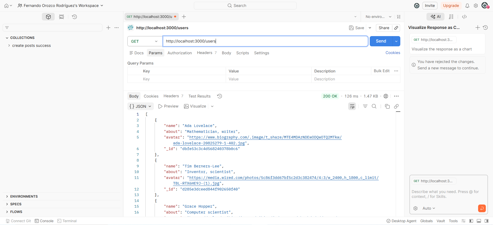
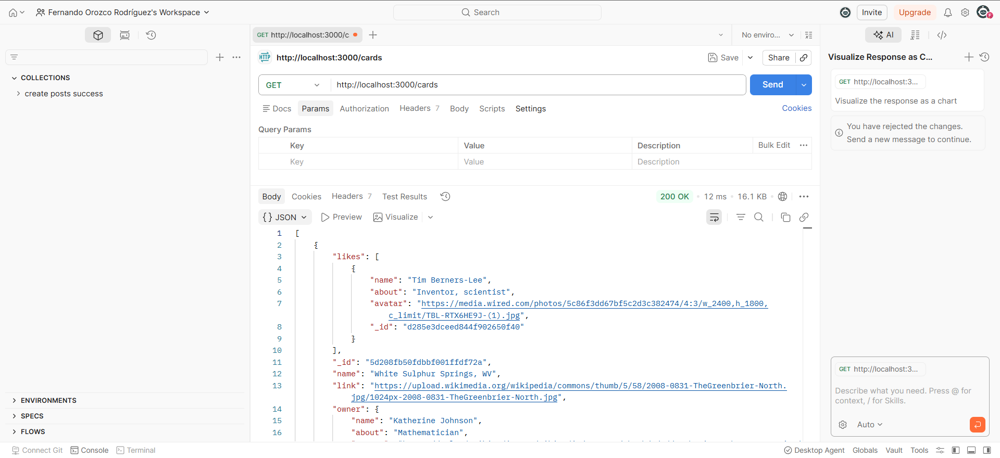
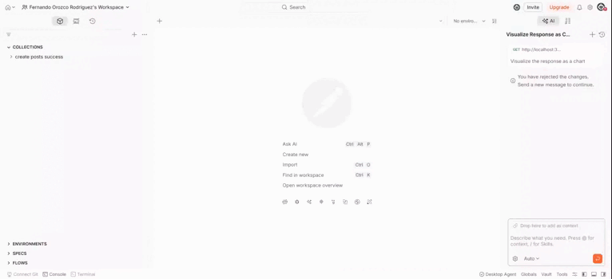
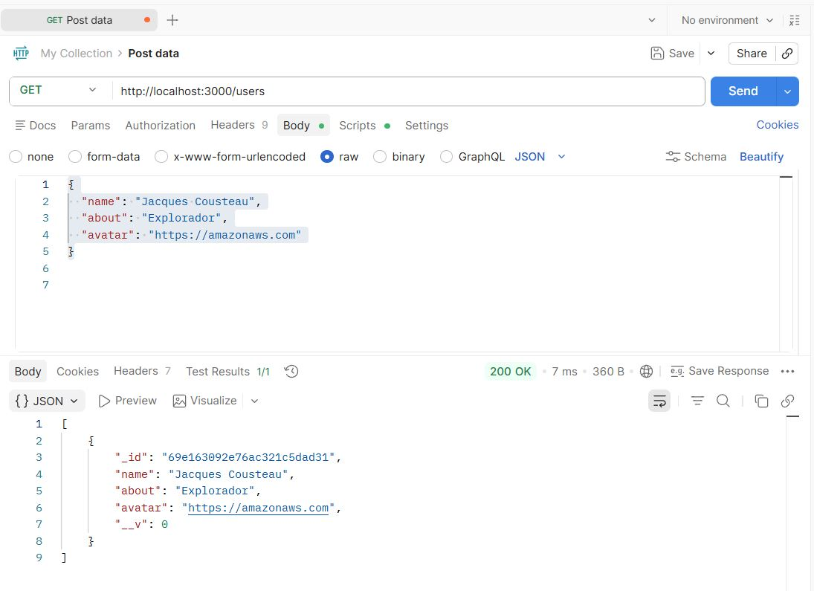
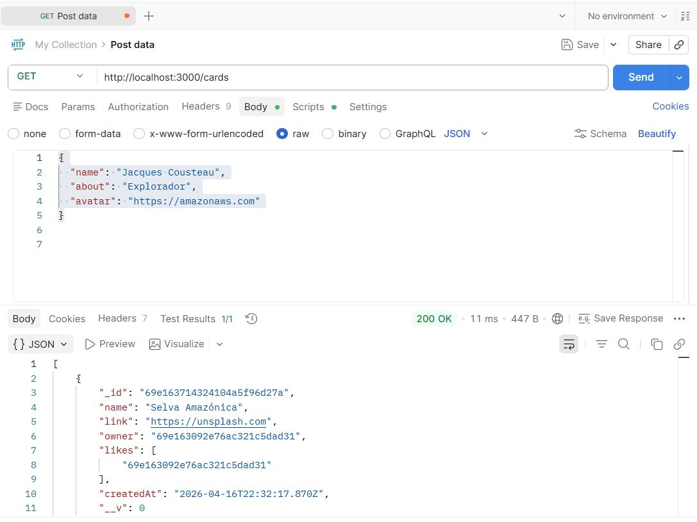
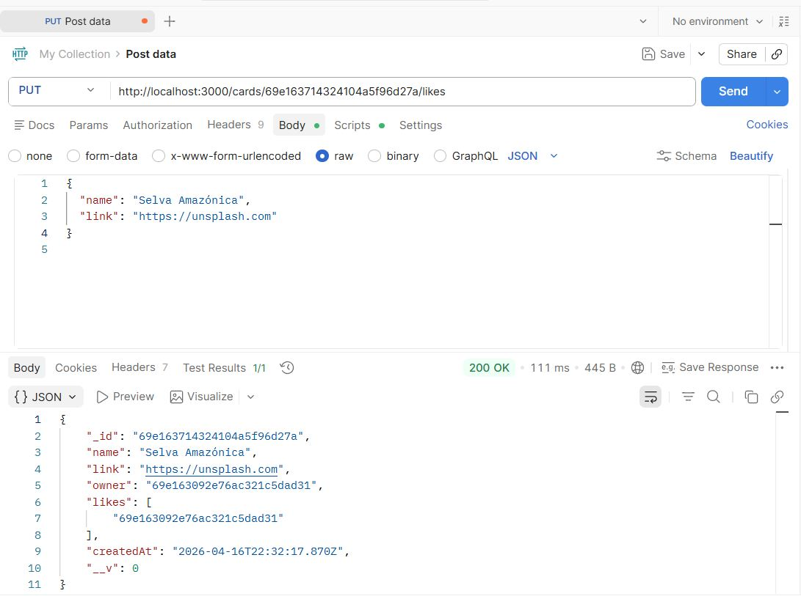
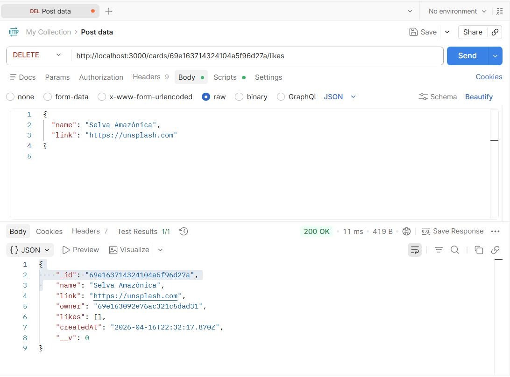
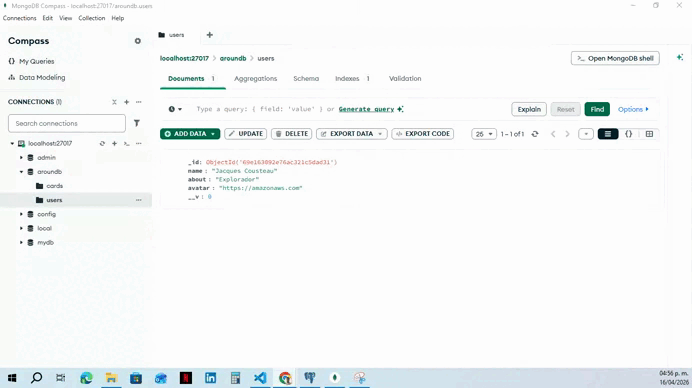
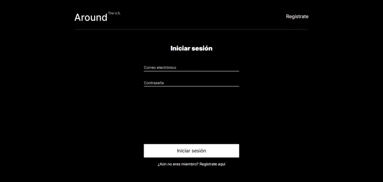

# Tripleten web_project_around_auth
# Around The U.S. (Autenticación y Registro)

Este proyecto es una aplicación web interactiva que permite a los usuarios compartir fotos de sus viajes por los Estados Unidos. En esta fase, se ha implementado un sistema completo de registro, inicio de sesión y persistencia de datos mediante tokens JWT.

## Tecnologías Utilizadas

*   **React** (Vite/Create React App)
*   **React Router DOM** (Gestión de rutas y navegación)
*   **CSS3** (Diseño responsivo y Flexbox)
*   **BEM Methodology** (Organización de estilos)
*   **API REST** (Comunicación con servidores externos)
*   **LocalStorage** (Persistencia del token de sesión)

## Funcionalidades Principales

1.  **Autenticación de Usuarios:** Los usuarios pueden registrarse e iniciar sesión de forma segura.
2.  **Protección de Rutas:** Se implementó un componente `ProtectedRoute` para asegurar que solo los usuarios autenticados puedan acceder a la página principal.
3.  **Persistencia de Sesión:** Gracias al uso de `localStorage` y la validación de tokens al cargar la página, el usuario no necesita iniciar sesión repetidamente al refrescar el sitio.
4.  **Diseño Responsivo:** El sitio está optimizado para dispositivos móviles, tablets y escritorio, incluyendo un menú de navegación adaptable (hamburguesa).
5.  **Feedback Visual:** Uso de ventanas modales (`InfoTooltip`) para informar al usuario sobre el éxito o fallo en sus peticiones.

## Instalación y Ejecución

Para ejecutar este proyecto localmente, sigue estos pasos:

1.  Clona el repositorio:
    ```bash
    git clone https://github.com/ferni2309/web_project_around_react
    ```
2.  Instala las dependencias:
    ```bash
    npm install
    ```
3.  Inicia el servidor de desarrollo:
    ```bash
    npm run dev
    ```

## Endpoints Utilizados

*   **Registro y Login:** `https://se-register-api.en.tripleten-services.com/v1"`
*   **Datos de Usuario y Tarjetas:** `https://around-api.es.tripleten-services.com/v1`

### Demostración
> 
> 
> 
> <video src="src/images/video.webm" width="600" controls></video>
> 
> 
> 
> 
> 
Nuevas imagenes, gif y video:
> .JPG)
> <video src="src/images/Solicitudes_a_los_servidores.mp4" width="600" controls></video>
> 
> 

---
**Proyecto desarrollado por:** C. Fernando Orozco Rodríguez
**El enlace a GitHub Repo:** https://github.com/ferni2309/web_project_around_auth 
